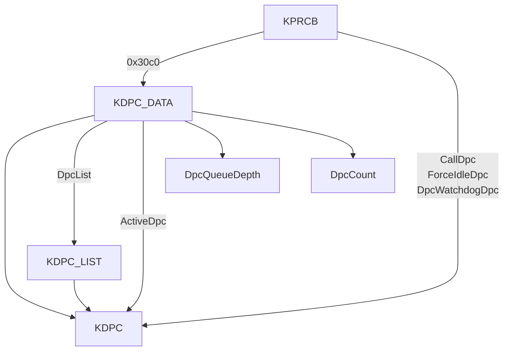

# DPC-特殊过程调用

## 前言

> IRQL为核心的优先级规则是NT内核运行的根本法则。 IRQL机制的一条核心规则是如果CPU有高IRQL的事情没有做完，那么就不去做低IRQL级别的事情。如果有一些代码利用  KeRaiseIRQL提升当前的IRQL级别然后没有降下来，系统运行可能会发生故障。
>
> 当IRQL级别高于  DISPATCH_LEVEL时，是不可以调用**KeWaitForSingleObject**这样的等待函数时 （高级别的IRQL上等待会导致系统级别的死锁，大部分内核函数只能在 DISPATCH_LEVEL上调用，或者在APC_LEVEL上调用。）
>
> **等级森严的IRQL**规则决定了在**高IRQL**时的操作要**快速完成**，对应的代码要简单短小。如果确实需要执行比较长的操作时，出现了DPC。

> 延迟过程调用 Deffered Procudure Call,DPC

> 之前在学习Windows加载过程中，第一个线程变成IdleThread之前，会检测KRPCB处理器控制块中的DPC队列，如果有便执行。

> * 过多步骤的任务 随着上层请求下来
> * 使用一个完成调用例程，-> 告诉上层我完成了。
> * 将剩余的处理过程放入DPC的队列中（缓冲机制）
> * 系统空闲时再来执行。


### 1. 使用模式

> 使用DPC的一个典型场景是  设备驱动程序的**中断处理函数ISR**。 ISR一般在 **DIRQL**（用于处理硬件设备的中断）级别（x86为 3-26；x64为 3-11）上运行，不适合做复杂操作，如果需要复杂操作，就应该使用DPC。
>
> 事先将已经初始化的DPC对象插入某个CPU的 DPC队列中。  **DDI!KeInsertQueueDpc**函数向DPC队列插入DPC。
>
> 在WDF中，封装了一个名为 **Wdf**Interrupt**Queue**Dpc**For**Isr的函数来简化操作。
>
> **WdfInterruptQueueDpcForIsr**

> NT内核为系统中的每个CPU维护一个DPC队列，在内核调试会话中，
>
> !pcr    !dpcs 观察DPC队列


```
0: kd> !pcr
KPCR for Processor 0 at fffff802673b4000:
    Major 1 Minor 1
	NtTib.ExceptionList: fffff8026b297fb0
	    NtTib.StackBase: fffff8026b296000
	   NtTib.StackLimit: 0000000000000000
	 NtTib.SubSystemTib: fffff802673b4000
	      NtTib.Version: 00000000673b4180
	  NtTib.UserPointer: fffff802673b4870
	      NtTib.SelfTib: 000000c2cd16c000

	            SelfPcr: 0000000000000000
	               Prcb: fffff802673b4180
	               Irql: 0000000000000000
	                IRR: 0000000000000000
	                IDR: 0000000000000000
	      InterruptMode: 0000000000000000
	                IDT: 0000000000000000
	                GDT: 0000000000000000
	                TSS: 0000000000000000

	      CurrentThread: fffff80269139a00
	         NextThread: 0000000000000000
	         IdleThread: fffff80269139a00

	          DpcQueue: Unable to read nt!_KDPC_DATA.DpcListHead.Flink @ fffff802673b7240
```


> DPC队列一般在 执行高IRQL级别的复杂任务时，  内核驱动会优先返回 IO完成，然后将后续的任务插入到DPC队列中，后面将 IRQL级别降下来再去处理。

```
0: kd> !dpcs
CPU Type      KDPC       Function
 0: Normal  : 0xffffb20b4a062618 0xfffff800429d76f0 ndis!ndisInterruptDpc
 0: Normal  : 0xffffb20b4a855c70 0xfffff80041e03850 Wdf01000!FxInterrupt::_InterruptDpcThunk
 0: Normal  : 0xffffb20b4aa23470 0xfffff80044325f20 i8042prt!I8042KeyboardIsrDpc
 0: Normal  : 0xffffb20b4aa57410 0xfffff80044465c90 USBPORT!USBPORT_IsrDpc
 0: Normal  : 0xffffb20b4aa546e8 0xfffff800448c4220 dxgkrnl!DpiFdoDpcForIsr
```

> 每个DPC对象都是一个KDPC结构
>
> dt _DPC [address]


```
0: kd> dt _KDPC 0xfffff8004150b2e0
ntdll!_KDPC
   +0x000 TargetInfoAsUlong : 0x113
   +0x000 Type             : 0x13 ''	// Windbg显示两个都是 从0字节开始 说明这是一个Union联合体
   +0x001 Importance       : 0x1 ''
   +0x002 Number           : 0
   +0x008 DpcListEntry     : _SINGLE_LIST_ENTRY
   +0x010 ProcessorHistory : 1
   // 指向Dpc关联的回调函数  这里是   nt!KdpTimeSlipDpcRoutine
   +0x018 DeferredRoutine  : 0xfffff800`411cbf70     void  nt!KdpTimeSlipDpcRoutine+0
   +0x020 DeferredContext  : (null) 
   +0x028 SystemArgument1  : (null) 
   +0x030 SystemArgument2  : (null) 
   +0x038 DpcData          : 0xfffff800`41509b50 Void
```


### 2. _KDPC   - Win10 1909

```c

//0x40 bytes (sizeof)
struct _KDPC
{
    union
    {
        ULONG TargetInfoAsUlong;                                            //0x0
        struct
        {
            UCHAR Type;                                                     //0x0
            UCHAR Importance;                                               //0x1
            volatile USHORT Number;                                         //0x2
        };
    };
    struct _SINGLE_LIST_ENTRY DpcListEntry;                                 //0x8
    ULONGLONG ProcessorHistory;                                             //0x10
    // DeferredRoutine 函数指针，指向DPC关联的回调函数
    VOID (*DeferredRoutine)(struct _KDPC* arg1, VOID* arg2, VOID* arg3, VOID* arg4); //0x18
    VOID* DeferredContext;                                                  //0x20
    VOID* SystemArgument1;                                                  //0x28
    VOID* SystemArgument2;                                                  //0x30
    // 
    VOID* DpcData;                                                          //0x38
}; 


```

> 系统会在什么时候清理DPC队列呢，将IRQL降低到  **DISPATCH_LEVEL**或者以下时，清理DPC队列。

> 根据栈回溯可以看到:   
>
> 清理DPC时发生在  空闲线程

```
nt!KeInsertQueueApc

nt!KiExecuteAllDpcs
nt!KiRetireDpcList
nt!KiIdleLoop
```


### 3. _KDPC Win7

> DPC  数据结构体在各个版本之前有所不同, 如果使用旧版本的结构体向内核写入数据可能会造成BSOD。

```c
//0x40 bytes (sizeof)
struct _KDPC
{
    UCHAR Type;                                                             //0x0
    UCHAR Importance;                                                       //0x1
    volatile USHORT Number;                                                 //0x2
    struct _LIST_ENTRY DpcListEntry;                                        //0x8
    VOID (*DeferredRoutine)(struct _KDPC* arg1, VOID* arg2, VOID* arg3, VOID* arg4); //0x18
    VOID* DeferredContext;                                                  //0x20
    VOID* SystemArgument1;                                                  //0x28
    VOID* SystemArgument2;                                                  //0x30
    VOID* DpcData;                                                          //0x38
}; 
```


### _KDPC_DATA

> CPU 控制块包含  KDPC_DATA结构体

```c
//0x28 bytes (sizeof)  win10
struct _KDPC_DATA
{
    struct _KDPC_LIST DpcList;                                              //0x0
    // Dpc锁    KSPIN_LOCK
    ULONGLONG DpcLock;                                                      //0x10
    // Dpc队列的深度
    volatile LONG DpcQueueDepth;                                            //0x18
    // Dpc对象数目
    ULONG DpcCount;                                                         //0x1c
    // 小于8.1版本 没有此域
    struct _KDPC* volatile ActiveDpc;                                       //0x20
}; 
```


### _KDPC_LIST

```
//0x10 bytes (sizeof)
struct _KDPC_LIST
{
    struct _SINGLE_LIST_ENTRY ListHead;                                     //0x0
    struct _SINGLE_LIST_ENTRY* LastEntry;                                   //0x8
}; 
```


## DPC过程

* 应用程序发起异步I/O请求，例如读数据			0
* 设备驱动程序收到请求后向硬件下发操作指令		0
* 硬件准备好数据后，通过中断**通知驱动程序**      中断- IRQL N/A
* 驱动程序地ISR（中断请求例程）简单处理，向DPC队列插入一个DPC          DIRQL  （3-26，4-11）处理设备中断
* DPC的回调函数被执行，对数据做处理后，插入APC通知应用程序           2
* 系统投递APC，应用程序的回调函数被调用，得到通知和数据。


## 结构体串接




### Dumping Dpc Queues

> 首先在  KeInsertQueueDpc下断
>
> 当系统断下后，根据 KDPC结构中的 DeferredRoutine 回调例程获取执行函数
>
> 继续下断

> ```
> nt!KeInsertQueueDpc
> ```


> 然后此时查看当前处理器的IRQL级别    可以看到为11

```
0: kd> !prcb
PRCB for Processor 0 at fffff8003f634180:
Current IRQL -- 11
Threads--  Current ffffb20b4c342240 Next 0000000000000000 Idle fffff8004153da00
Processor Index 0 Number (0, 0) GroupSetMember 1
Interrupt Count -- 00098657
Times -- Dpc    000000a1 Interrupt 00000052 
         Kernel 000024bc User      00001552 
```


```
0: kd> dt nt!_KDPC_DATA fffff8003f634180+0x30c0
   +0x000 DpcList          : _KDPC_LIST
   +0x010 DpcLock          : 0
   +0x018 DpcQueueDepth    : 0n1
   +0x01c DpcCount         : 0x37093
   +0x020 ActiveDpc        : (null) 
```


> 当DPC对象被计划运行时（空闲线程下DPC对象无法运行），  KRPCB处理器控制块中的  DpcStack被用来初始化DPC的栈。

> 保存 DpcRoutine的 RSP的值，利用该值找到   PRCB中的 DpcStack
>
> 查看DpcStack的正上方并找到DpcData    

```
0: kd> dt nt!_KPRCB fffff8003f634180 -y DpcStack
   +0x3110 DpcStack : 0xfffff800`436a8fb0 Void
0: kd> r
rax=fffff800411cbf70 rbx=fffff8003f637240 rcx=fffff8004150b2e0
rdx=0000000000000000 rsi=fffff800436a8e80 rdi=fffff8003f634180
rip=fffff800411cbf70 rsp=fffff800436a8ba8 rbp=fffff800436a8cb0
 r8=0000000000000000  r9=0000000000000000 r10=fffff800411cbf70
r11=0000000000000000 r12=00000de72daeb7b4 r13=0000000000000000
r14=fffff8004150b2e0 r15=fffff80041509b50
iopl=0         nv up ei pl zr na po nc
cs=0010  ss=0018  ds=002b  es=002b  fs=0053  gs=002b             efl=00000246
nt!KdpTimeSlipDpcRoutine:
fffff800`411cbf70 4883ec28        sub     rsp,28h
```


```
0: kd> dt nt!_KPRCB fffff8003f634180 -y DpcData
   +0x30c0 DpcData : [2] _KDPC_DATA
```

> KDPC_DATA 被嵌入在 KPRCB结构

> 

```
nt!KdpTimeSlipDpcRoutine:
fffff800`411cbf70 4883ec28        sub     rsp,28h
0: kd> dt nt!_KPRCB fffff8003f634180 -y DpcData
   +0x30c0 DpcData : [2] _KDPC_DATA
0: kd> dd fffff8003f634180+0x30c0
fffff800`3f637240  4a062620 ffffb20b 4aa546f0 ffffb20b
fffff800`3f637250  00000000 00000000 00000005 00037098
fffff800`3f637260  4150b2e0 fffff800 00000000 00000000
fffff800`3f637270  3f637268 fffff800 00000000 00000000
fffff800`3f637280  00000000 00000000 00000000 00000000
fffff800`3f637290  436a8fb0 fffff800 00000004 00000007
fffff800`3f6372a0  00000003 00037092 00010001 00000023
fffff800`3f6372b0  00000000 00003a0e 00004bb5 00003a4c
0: kd> dt nt!_KDPC_DATA fffff8003f637240
   +0x000 DpcList          : _KDPC_LIST
   +0x010 DpcLock          : 0
   +0x018 DpcQueueDepth    : 0n5
   +0x01c DpcCount         : 0x37098
   +0x020 ActiveDpc        : 0xfffff800`4150b2e0 _KDPC
```


```
     0 e Disable Clear  fffff800`40a2ac00     0001 (0001) nt!KeInsertQueueDpc
     1 e Disable Clear  fffff800`411cbf70     0001 (0001) nt!KdpTimeSlipDpcRoutine
     2 e Disable Clear  fffff800`40b113cc     0001 (0001) nt!KiInsertQueueApc
     3 e Disable Clear  fffff800`448c4220     0001 (0001) dxgkrnl!DpiFdoDpcForIsr
     4 e Disable Clear  fffff800`44465c90     0001 (0001) USBPORT!USBPORT_IsrDpc
     5 e Disable Clear  fffff800`44325f20     0001 (0001) i8042prt!I8042KeyboardIsrDpc
     6 e Disable Clear  fffff800`41e03850  [minkernel\wdf\framework\shared\irphandlers\pnp\km\interruptobjectkm.cpp @ 392]     0001 (0001) Wdf01000!FxInterrupt::_InterruptDpcThunk
     /*
     ndis.sys    NDIS (Network Driver Interface Specification)
     which allows Windows to communicate with hardware and connected devices on a computer network
     */
     
     7 e Disable Clear  fffff800`429d76f0     0001 (0001) ndis!ndisInterruptDpc
```


> SEH  _try主要用来验证和访问用户模式地址（确保锁定了页面，使用ProbeForRead/Write）

#### ProbeForRead

> https://docs.microsoft.com/en-us/windows-hardware/drivers/ddi/wdm/nf-wdm-probeforread

```c
// 检测用户模式缓冲区是否真正位于  用户指定的地址空间，并且被正确分配。
void ProbeForRead(
    // 用户模式缓冲区的首地址
  [in] const volatile VOID *Address,
  [in] SIZE_T              Length,
  [in] ULONG               Alignment
);
```


```c
// Checks that a user-mode buffer actually resides in the user-mode portion of the address space, is writable, and is correctly aligned.
void ProbeForWrite(
  [in, out] volatile VOID *Address,
  [in]      SIZE_T        Length,
  [in]      ULONG         Alignment
);
```


#### MmIsAddressValid

> https://www.cnblogs.com/Ox9A82/p/5571217.html

> How to probe/validate the address of DpcData?

> 我们怎么确定得到正确的地址，我们怎样验证DpcData的地址。

> A bad way to do it (sometimes it's neccessay) is to use **MmIsAddressValid**

> MmIsAddressValid  检查读写操作会不会触发一个页错误 no page fault, 常常用来检测地址合不合法


```c
BOOLEAN
MiIsAddressValid (
    IN PVOID VirtualAddress,
    IN LOGICAL UseForceIfPossible
    )
{
    PMMPTE PointerPte;


    //
    // If the address is not canonical then return FALSE as the caller (which
    // may be the kernel debugger) is not expecting to get an unimplemented
    // address bit fault.
    //

    if (MI_RESERVED_BITS_CANONICAL(VirtualAddress) == FALSE) {
        return FALSE;
    }


	// 根据虚拟地址 使用MiGetPdeAddress  页目录指针表 -> 页表项
    PointerPte = MiGetPdeAddress (VirtualAddress);
    if (PointerPte->u.Hard.Valid == 0) {
        return FALSE;
    }

    if (MI_PDE_MAPS_LARGE_PAGE (PointerPte)) {
        return TRUE;
    }
	
    // MiGetPteAddress 
    PointerPte = MiGetPteAddress (VirtualAddress);
    if (PointerPte->u.Hard.Valid == 0) {
        return FALSE;
    }

    //
    // Make sure we're not treating a page directory as a page table here for
    // the case where the page directory is mapping a large page.  This is
    // because the large page bit is valid in PDE formats, but reserved in
    // PTE formats and will cause a trap.  A virtual address like c0200000 (on
    // x86) triggers this case.
    //

    if (MI_PDE_MAPS_LARGE_PAGE (PointerPte)) {
        return FALSE;
    }

    return TRUE;
}
/*
每个进程都有自己的进程页表和页目录，但是内核在分配一个进程的地址空间时会把PD复制，以便于访问

以分页来管理内存，页为单位，如果内存页的第一个字节可写，则整个页可写
*/
```

> MmIsAddressValid   用来验证虚拟地址是不是一个有效的PTE 则返回TRUE。该函数不适用的原因是：
>
> * It's prone to race conditions  容易引起条件竞争  该地址可能在调用 MmIsAddressValid后变得无效
>
> * 该函数有个drawback缺点：  如果内存页被换出了，将返回FALSE。 
>
>   如果我们希望返回TRUE，因为我们渐渐访问一个已被换出的地址（IRQL几倍不大于 DISPATCH_LEVEL2， 并且不在文件系统换页IO处理程序中），然后它应该会换入内存中，然后给出我们期望的内存。
>
>   为了方式该地址被换出，我们不能使用**MmIsAddressValid**


> https://www.unknowncheats.me/forum/anti-cheat-bypass/314342-read-unknown-kernel-address-safe.html
>
> Read Unknown Kernel Address Safely


#### MmCopyMemory

> https://docs.microsoft.com/en-us/windows-hardware/drivers/ddi/ntddk/nf-ntddk-mmcopymemory

> 拷贝指定返回的虚拟地址或物理内存到 调用者提供的缓冲区中。
>
> *Kernel-mode drivers can call this routine to safely access arbitrary physical or virtual addresses*

```c
NTSTATUS MmCopyMemory(
  [in]  PVOID           TargetAddress,
  [in]  MM_COPY_ADDRESS SourceAddress,
  [in]  SIZE_T          NumberOfBytes,
  [in]  ULONG           Flags,
  [out] PSIZE_T         NumberOfBytesTransferred
);
```

> MmCopyMemory 允许调用者安全地读取任意数量的内存

> 该函数从 8.1才有，在这之前，可以使用  **MmMapIoSpace**  为一段物理地址创建另一块虚拟地址，然后使用新的内存去读取页面。
>
> 该方法的缺点是 如果地址返回超过了一个页面稍微比较困难。

> 在本例中，这些函数无法使用，因为同步问题。（待会讨论） 我们需要访问这些数据结构在  **HIGH_LEVEL** IRQL 阻止抢占和条件竞争（**prevent preemption and race conditions**） 
>
> DpcData的地址 必定是从  KPRCB中获取的，意味着我们可以安全地访问这些成员。


```c
typedef struct _KDPC_DATA {    
    _KDPC_LIST DpcList
	KSPIN_LOCK DpcLock;
	LONG DpcQueueDepth;
	ULONG DpcCount;
	PKDPC ActiveDpc;
} KDPC_DATA, *PKDPC_DATA;

typedef struct _KDPC_LIST {
	SINGLE_LIST_ENTRY ListHead;
	PSINGLE_LIST_ENTRY LastEntry;
} KDPC_LIST, * PKDPC_LIST;


typedef struct _SINGLE_LIST_ENTRY {
    struct _SINGLE_LIST_ENTRY *Next;
} SINGLE_LIST_ENTRY, *PSINGLE_LIST_ENTRY;
```


#### MmMapIoSpace

> https://docs.microsoft.com/en-us/windows-hardware/drivers/ddi/wdm/nf-wdm-mmmapiospace
>
> MmMapIoSpace 例程**映射**给定的物理地址到系统**非分页内存空间**


```c
// MEMORY_CACHING_TYPE 枚举类型 当分配或映射内存时指定缓冲行为
typedef enum _MEMORY_CACHING_TYPE {
  MmNonCached,
  MmCached,
  MmWriteCombined,
  MmHardwareCoherentCached,
  MmNonCachedUnordered,
  MmUSWCCached,
  MmMaximumCacheType,
  MmNotMapped
} MEMORY_CACHING_TYPE;

PVOID MmMapIoSpace(
  [in] PHYSICAL_ADDRESS    PhysicalAddress,
  [in] SIZE_T              NumberOfBytes,
  [in] MEMORY_CACHING_TYPE CacheType
);
```


> 执行一些验证操作
>
> 1. 使用 **KeInsertQueueDpc** 插入DPC，然后在 DpcRoutine 验证  ActiveDpc指向我们地DPC对象
> 2. 插入一个非常重要HighImportance的DPC，然后比较DpcData-> ListHead.Next  与 我们Dpc对象的DpcListEntry 
> 3. 插入一个不是很重要的DPC，进行比较
> 4. 在插入一个新的DPC对象后， 验证DpcCount，DpcQueueDepth都会加1.  be increased by one.
> 5. 在移除DPC对象后，DpcQueueDepth DpcCount都会减少


#### Synchronization Issues

> 现在有了 DpcData的地址，我们可以迭代队列中的DPCs，打印信息。
>
> DpcData结构体在 KPRCB处理器控制块结构体中  意味着这是每一个处理器都有一个DpcData
>
> 在访问此数据结构之前，立即下我们需要处理的同步问题


1. Synchronization   **PASSIVE_LEVEL**

   > 正常情况下，当我们想要访问 在多个线程之间共享的数据结构（都运行在PASSIVE_LEVEL） 我们需要使用一些同步原语
   >
   > typically 一些类型的锁 会阻止两个线程同时更改数据结构。
   >
   > Windows内核我们会使用   **ERESOURCE** 读写锁同步访问，用户模式下会使用关键区。 **Critical Section**

> 如果我们想在  DISPATCH_LEVEL访问该结构体怎么办？


#### Whats IRQL?

> IRQL 就是定义CPU的优先级别。 用户模式下运行在0级别 PASSIVE_LEVEL。
>
> 每个注册的中断都有一个分配的级别.
>
> 中断到达CPU时，CPU会检测当前CPU级别是否高于中断的级别，如果级别>= 中断将会挂起直到CPU降低IRQL。
>
> 之后中断才会执行。该机制主要用于：
>
> 1. 允许硬件设备立即中断执行（中断处理器需要执行非常快）
> 2. 允许软件中断执行。 例如APC,DPC都是通过软件中断实现的。特殊的内核APC运行在  APC_LEVEL
> 3. 帮助上下文切换


#### Synchronization at DISPATCH_LEVEL

> 代码运行在 DISPATCH_LEVEL   This will typically occur if you:
>
> * Write network filters   一些network filters 回调就在  DISPATCH_LEVEL上调用（WFP）Windows Filtering Platform 为网络数据包过滤提供的一套框架
> * 使用 KTIMER 计时器
> * 写中断处理器  - DPCs被插入到**中断处理器**然后继续执行DPC后续任务
> * Raise 提升**IRQL**到 DISPATCH_LEVEL级别


##### KTIMER

> 计时器通过插入一个DPC工作，DPC 延迟过程调用在 DISPATCH_LEVEL级别上执行。

```
//0x40 bytes (sizeof)
struct _KTIMER
{
    struct _DISPATCHER_HEADER Header;                                       //0x0
    union _ULARGE_INTEGER DueTime;                                          //0x18
    struct _LIST_ENTRY TimerListEntry;                                      //0x20
    struct _KDPC* Dpc;                                                      //0x30
    ULONG Processor;                                                        //0x38
    ULONG Period;                                                           //0x3c
}; 
```


> 为了在 DISPATCH_LEVEL同步，需要使用一个同步对象 spin lock 旋转锁。
>
> 旋转锁是一个标志可以被获取或者释放。
>
> 当你想要获取旋转锁时，只能在循环中持续等待，直到旋转锁被释放，然后改变标志位为获取。
>
> 释放旋转锁时 set flag = released  也称之为”繁忙等待“
>
> **同步对象**主要用来在**高级别**的**IRQL**上

> WaitForObject 无法用于 在 DISPATCH_LEVEL几倍上的，因为计划任务程序不会被执行。


#### 不同的IRQL级别 使用Spin lock => Deadlock

```c
//
// Runs at IRQL 3 (DIRQL)
//
VOID InterruptHandler() 
{
	//
	// When an interrupt arrives get the DEVICE_JOB
	// and queue it
	//
	DEVICE_JOB* Info = GetDeviceJob();

	AcquireSpinLock(&DeviceJobQueue->Lock);

	QueueDeviceJob(&DeviceJobQueue, Info);

	ReleaseSpinLock(&DeviceJobQueue->Lock);
}

//
// Runs at DISPATCH_LEVEL
//
VOID RunQueuedItems() 
{
	//
	// Process all the jobs in the queue every 10 seconds
	//
	while (TRUE) {
		Sleep(SECONDS(10));

		// DONT DO IT: There's a bug here.
		// Use spin lock to synchronize access to the queue.
		// Make sure that jobs cannot be added to the queue while processing

		AcquireSpinLock(&DeviceJobQueue->Lock);
		
		for (ULONG i = 0; i < DeviceJobQueue->JobCount; i++) {
			ProcessJob(&DeviceJobQueue->Queue[i]);
		}

        DeviceJobQueue->JobCount = 0;

		ReleaseSpinLock(&DeviceJobQueue->Lock);
	}

}
```

> 防止死锁的方法就是 
>
> 禁用 preemption 抢占。 因此需要将当前IRQL级别提升到 中断请求级别相同的水平。


```c
VOID RunQueuedItems() 
{
	//
	// Process all the jobs in the queue every 10 seconds
	//
	while (TRUE) {
		Sleep(SECONDS(10));

		while (TRUE) {
			
			KIRQL OldIrql;

			//
			// Get a job from the queue
			// Make sure to raise the IRQL when accessing the queue
			//
			KeRaiseIrql(DeviceJobIrql, &OldIrql);

			AcquireSpinLock(&DeviceJobQueue->Lock);
			DEVICE_JOB* DeviceJob = PopDeviceJobQueue(&DeviceJobQueue);
			ReleaseSpinLock(&DeviceJobQueue->Lock);

			KeLowerIrql(OldIrql);

			if (!JobQueue)
				break;

			//
			// Process the job
			//
			ProcessJob(Job);
		
		}
	}

}
```


> 类似的方法时使用DPC机制。

## Synchronizing with DPC functions

> DPCs 可以被从任何IRQL级别插入，意味着要同步这样的代码，我们可能需要提升到 HIGH_LEVEL。
>
> 参考 KeInsertQueueDpc实现，下列指令。

```assembly
0: kd> uf nt!KeInsertQueueDpc
nt!KeInsertQueueDpc:
fffff800`40a2ac00 4883ec38        sub     rsp,38h
fffff800`40a2ac04 4533c9          xor     r9d,r9d
fffff800`40a2ac07 c644242000      mov     byte ptr [rsp+20h],0
fffff800`40a2ac0c e80f000000      call    nt!KiInsertQueueDpc (fffff800`40a2ac20)
fffff800`40a2ac11 4883c438        add     rsp,38h
fffff800`40a2ac15 c3              ret
```


```assembly
mov     rcx, cr8       ; CR8 is the register that holds the current IRQL
mov     [rsp+TempIRQL], rcx
mov     eax, HIGH_LEVEL
mov     cr8, rax        ; Raise to HIGH_LEVEL
```

> 在提升  IRQL到 HIGH_LEVEL后 函数插入DPC到队列中


## Windbg

### KeInsertQueueDpc

> https://repnz.github.io/posts/practical-reverse-engineering/reversing-dpc-keinsertqueuedpc/
>
> 逆向 KeInsertQueueDpc   作者使用 win8.1 

> Explain how the following functions work: **KeInsertQueueDpc**,  **KiRetireDpcList**, **KiExecuteDpc**
>
> **KiExecuteAllDpcs**
>
> If you feel like an overachiever, decompile those functions from x86 and x64 assemblies and explain the differences


## 参考

* https://repnz.github.io/posts/practical-reverse-engineering/dumping-dpc-queues
