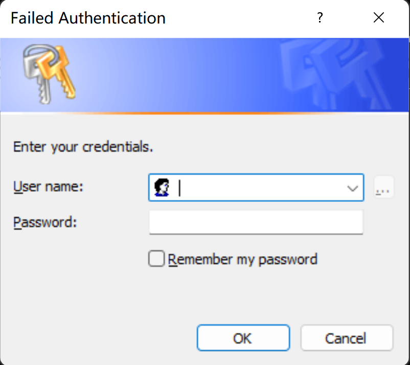

# Windows凭据对话框




> credui.dll 对应

```
CredPackAuthenticationBufferA
CredPackAuthenticationBufferW
CredUICmdLinePromptForCredentialsA
CredUICmdLinePromptForCredentialsW
CredUIConfirmCredentialsA
CredUIConfirmCredentialsW
CredUIInitControls
CredUIParseUserNameA
CredUIParseUserNameW
CredUIPromptForCredentialsA
CredUIPromptForCredentialsW
CredUIPromptForWindowsCredentialsA
CredUIPromptForWindowsCredentialsW
CredUIPromptForWindowsCredentialsWorker
CredUIReadSSOCredA
CredUIReadSSOCredW
CredUIStoreSSOCredA
CredUIStoreSSOCredW
CredUnPackAuthenticationBufferA
CredUnPackAuthenticationBufferW
SspiGetCredUIContext
SspiIsPromptingNeeded
SspiPromptForCredentialsA
SspiPromptForCredentialsW
SspiUnmarshalCredUIContext
SspiUpdateCredentials
```


> wincredui.dll

```
CredUIInternalCmdLinePromptForCredentialsA
CredUIInternalCmdLinePromptForCredentialsW
CredUIInternalConfirmCredentialsA
CredUIInternalConfirmCredentialsW
CredUIInternalInitControls
CredUIInternalPromptForCredentialsA
CredUIInternalPromptForCredentialsW
CredUIInternalPromptForWindowsCredentialsA
CredUIInternalPromptForWindowsCredentialsW
CredUIInternalPromptForWindowsCredentialsWorker
DllCanUnloadNow
DllGetClassObject
DllRegisterServer
DllUnregisterServer
```


```
00 0000005e`c5edccc8 00007ffc`8dd464cc     win32u!NtUserWaitMessage+0x14
01 0000005e`c5edccd0 00007ffc`8dd6924b     USER32!DialogBox2+0x254
02 0000005e`c5edcd70 00007ffc`8dd5fa48     USER32!InternalDialogBox+0x14b
03 0000005e`c5edcdd0 00007ffc`8dd5fc4d     USER32!DialogBoxIndirectParamAorW+0x58
04 0000005e`c5edce10 00007ffc`650a02ba     USER32!DialogBoxParamW+0x7d
05 0000005e`c5edce50 00007ffc`6509a4fc     wincredui!SHFusionDialogBoxParam+0x6a
06 0000005e`c5edce90 00007ffc`65088556     wincredui!CreduiPasswordDialog::CreduiPasswordDialog+0xb30
07 0000005e`c5edd230 00007ffc`65092a1c     wincredui!CredUIPromptForCredentialsWorker+0x346
08 0000005e`c5edd950 00007ffc`67172a54     wincredui!CredUIInternalPromptForCredentialsW+0x9c
09 0000005e`c5edd9c0 00007ff6`d41c3028     credui!CredUIPromptForCredentialsW+0x84
```


```
wincredui!CreduiPasswordDialog::CreduiPasswordDialog+0xb30:
```

