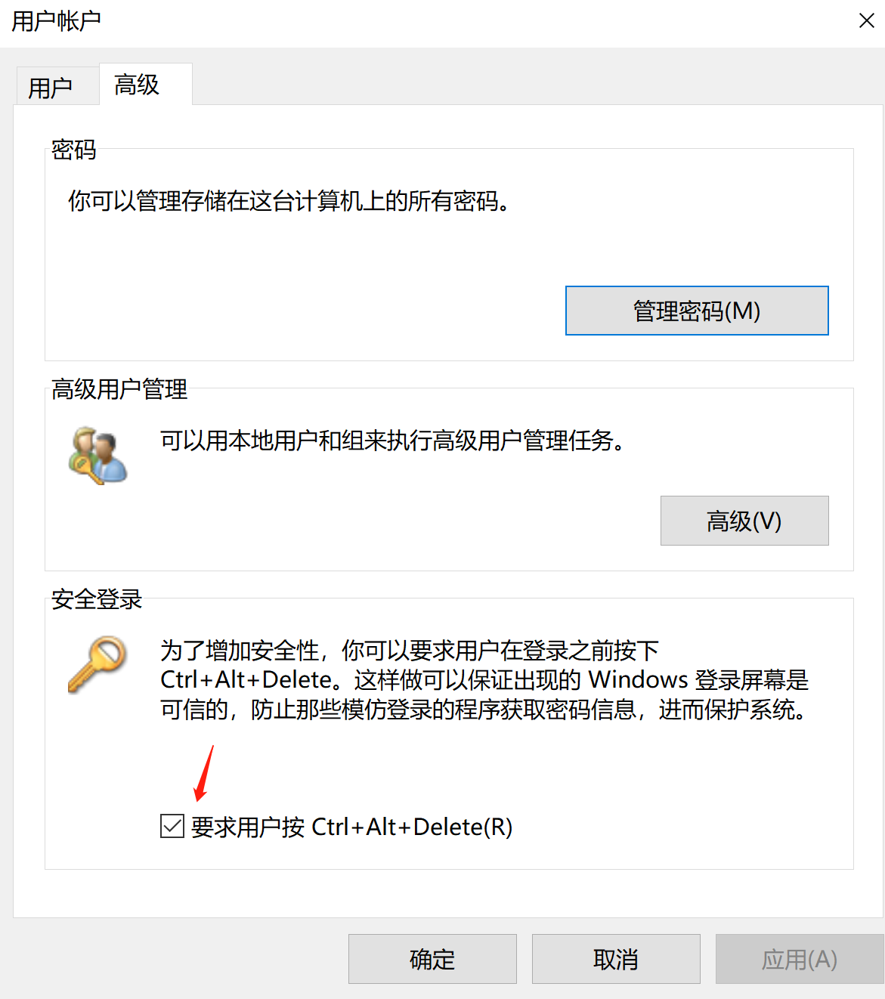
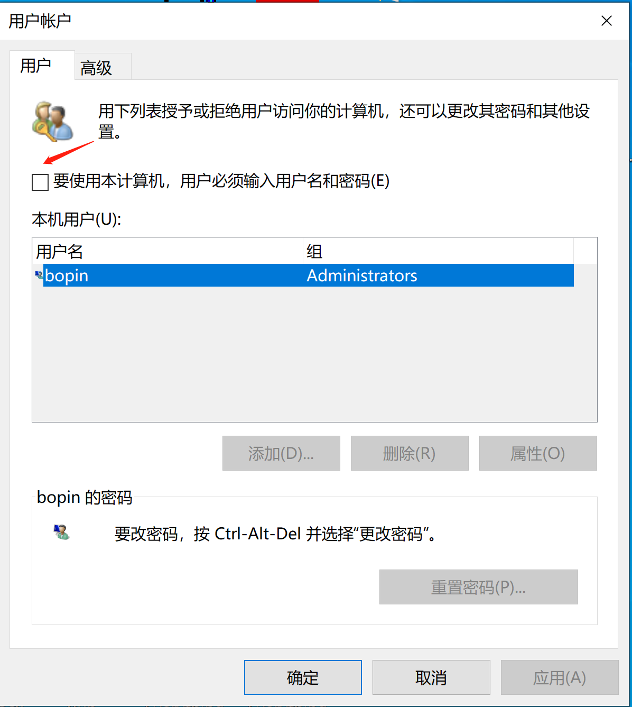

## 安全登录

> Secure Attention Sequence SAS安全警告序列，防止木马在登录时抓取用户凭据
>
> control userpasswords2 打开用户账户控制界面

## 配置自动登录

> 这里取消掉  用户必须输入用户名和密码，注意这里不对密码有效性进行验证。
>
> LocalAutoLogon.csv 是 procmon抓取的有关注册表键值  
>
> 测试环境  Win10 1909 x64

